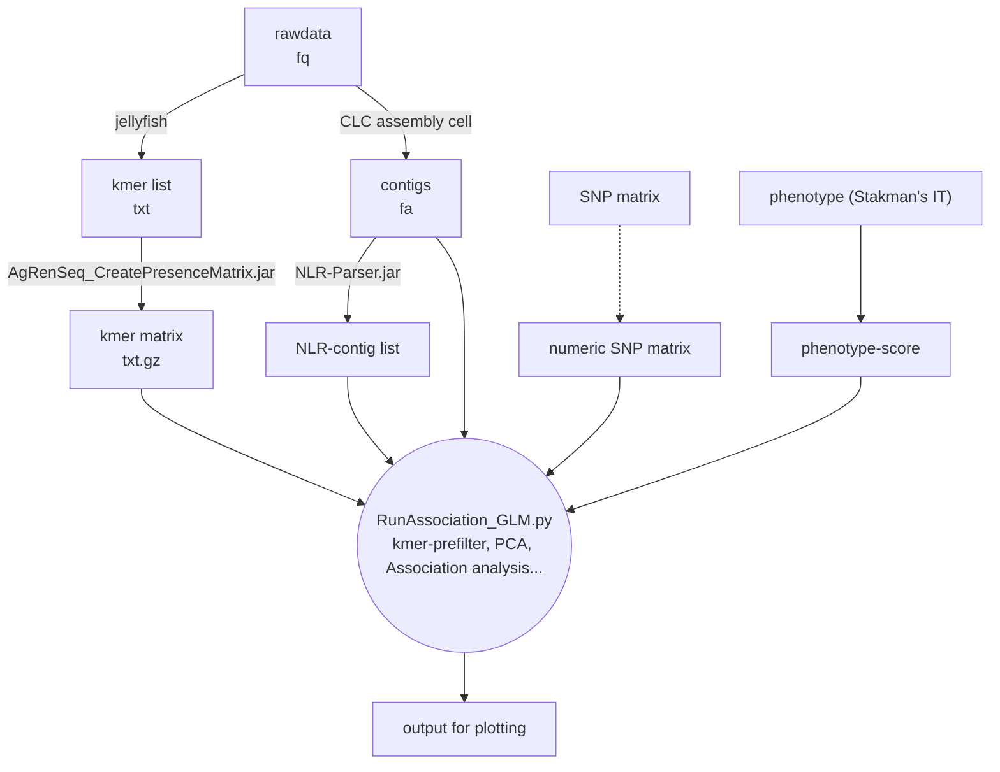
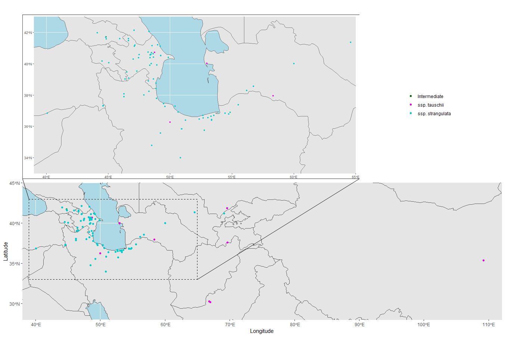
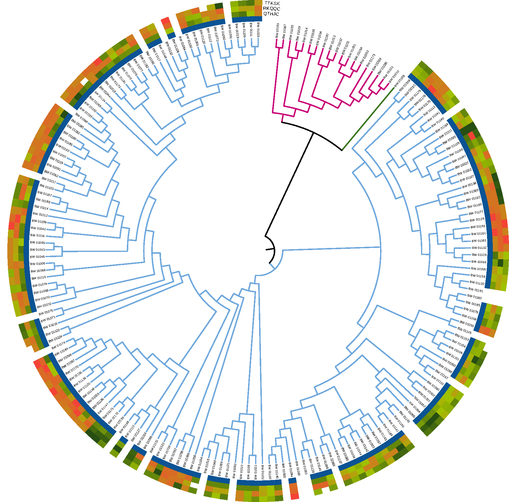
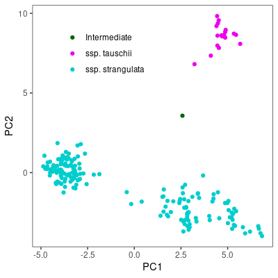
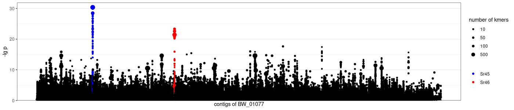

This is a reproduction of the research content of Arora et al.'s [article](https://doi.org/10.1038/s41587-018-0007-9).

Original codes: [steuernb/AgRenSeq (github.com)](https://github.com/steuernb/AgRenSeq), https://github.com/kgaurav1208/AgRenSeq_GLM

# 1. Pipeline overview




# 2. Problems with public-available codes

1. `jellyfish` is of too low efficiency. It can be replaced by `kmc`;
2. `CLC assembly cell` is a paid commercial soft ware. It can be replaced by open-source software `SPADES`;
3. Association analysis requires a numerically encoded SNP matrix, while the data provided is nucleotide (bases), which needs to be converted.
4. There are bugs in the Python script `RunAssociation_GLM.py`

# 3. Step-wise practice

## 3.1 Materials

The authors collected 175 *Ae. tauschii* ssp. *stragulata* accessions (with resistance to multiple *Pst* races), along with 19 *Ae. tauschii* ssp. *tauschii* accessions and an intermediate as outer group. A SNP matrix with 317 SNPs was used for phylogenetic alalysis and later PCA.



For phylogenetic analysis, a p-distance matrix was calculated and a UPGMA tree was built with `MEGA11`. On-line tool iTOL was used for tree annotation and modification. Colour of the branches distinguishes *Ae. tauschii* ssp. *stragulata* (cyan), *Ae. tauschii* ssp. *tauschii* (magenta) and intermediate (green). Coloured rings shows phenotype score coresponding to different *Pst* races. Magenta means -2 (susceptiable) and green means 2 (resistant). The blue ring on the inside represents samples used for phenotyping and association analysis.



## 3.2 k-mer manipulate

Reads from RenSeq of 195 accessions was split into 51-mers with `kmc` after QC. Resulting k-mer list is a tab delimited text file, in which the first column is  the sequence and the second column is the count of the k-mer. The k-mer matrix was then calculated with `AgRenSeq_CreatePresenceMatric.jar` as a gzipped text file. The header of the matrix which starts with "#" records sample names separated by ",", and the body of the matrix is 2 columns delimited by tab. The first column is the sequence and the second column is the presence string, in witch "0" means absence and "1" means presence. To reduce space usage, all "0"at the end of the string are omitted.

## 3.3 *de-novo* assembly of reference accession and NLR prediction

Accession BW_01077 was selected to reproduce the cloning of *Sr46* and *Sr45*, with the corresponding phenotype scores of the *Pst* race TTKSK (UG99) inoculation. An assembly consists of 64542 contigs with total length of 44.7 Mb, average length of 692 bp was generated by `SPADES` based on the 2.2 Gb raw data.

Using `NLR-Parser`, 1531 contigs that may contain NLR genes were predicted as the contig list for association analysis.

## 3.4 SNP matrix and PCA

As mentioned before, the SNP matrix provided by the authors can't be used directly, and they didn't show the detailed methods for converting. A self-made python script was employed to conduct missing value imputation, numerical encoding, and PCA. PCA matrix ready for later steps is a tab delimited text file with column names and row names, in witch columns record SNPs and rows record samples.



As the result shows, there is a population structure differentiation within *Ae. tauschii* ssp. *stragulata*, which can be divided into at least two sub-populations.

## 3.5 Phenotype data

Phenotype score was calculated by a self-made R script based on criteria provided by the authors. The result is a tab delimited text file without header, in witch the first column is the sample names and the second column is the score. 

## 3.6 Association analysis

### 3.6.1 Debug

The authors didn't provide versions of imported packages. After trials, it was determined that `pandas==0.23` and `statsmodels==0.11.1` are needed.

There are three main problems of the core script `RunAssociation_GLM.py`and relative scripts `KmerProjection_GLM.py`.

#### 3.6.1.1 Part of the code uses deprecated syntax and cannot run:

In line 60 and 129 of `KmerProjection_GLM.py`, `smf.OLS` should be replaced by `sm.OLS`, because in `statsmodels 0.11.1` method `OLS` is no longer supported for `statsmodels.formula.api`, use `statsmodels.api` instead.

#### 3.6.1.2 When the number of sample names in the k-mer matrix is more than the the names in the phenotype score, there is a possibility of index out of bounds in the code for calculating the correlation coefficient:

Add code for exception detection:

```python
try:
	if presence_bitarray[index]:
		presence_sum += 1
		presence_sqsum += 1
		presence_pheno_dot_product += self.phenotype.phenoScores_dict[accession]
except:
	print(accession, "excluded")
```

#### 3.6.1.3 The code did not consider the issue of omitting the tailing 0s in the k-mer matrix:

Add code for adding 0s to last digits.

```python
if len(presenceString)<len(header):
	print("filling tailing 0")
	presenceString+="0"*(len(header)-len(presenceString))
```

### 3.6.2 Analysis

Combining all intermediate results, *Sr45* and *Sr46* are successfully located on contigs NODE_269 and NODE_645, respectively.



